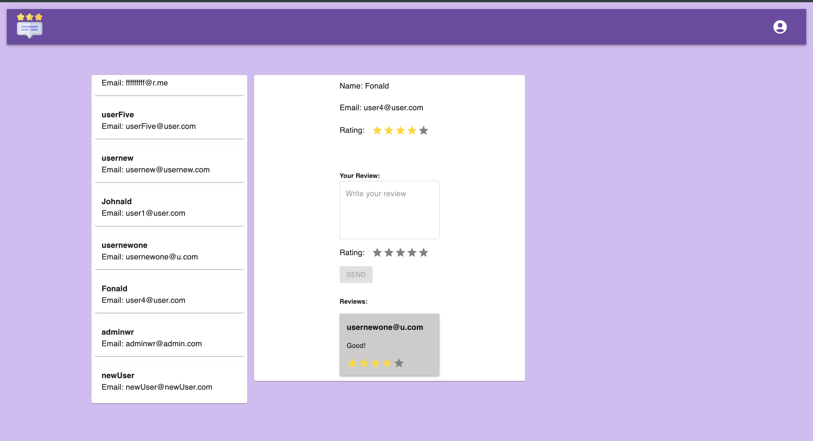

# Review-Rating-System

## Stack

✅ HTML (JSX)

✅ JavaScript ES6+

✅ React

✅ Firebase

✅ React Router

✅ Redux Toolkit

✅ Material UI

✅ ESlint

✅ Jest

____

## Installation and Usage

**Installation:**

* Clone the repository: git clone https://github.com/reyand8/Review-Rating-System.git

**Usage:**

- Navigate to the project directory: cd user-review-system
- Install dependencies: npm install
    - Run the project: npm run start
    - Open a browser and navigate to: http://localhost:3000

**Note: Only admin can delete reviews.**
____

